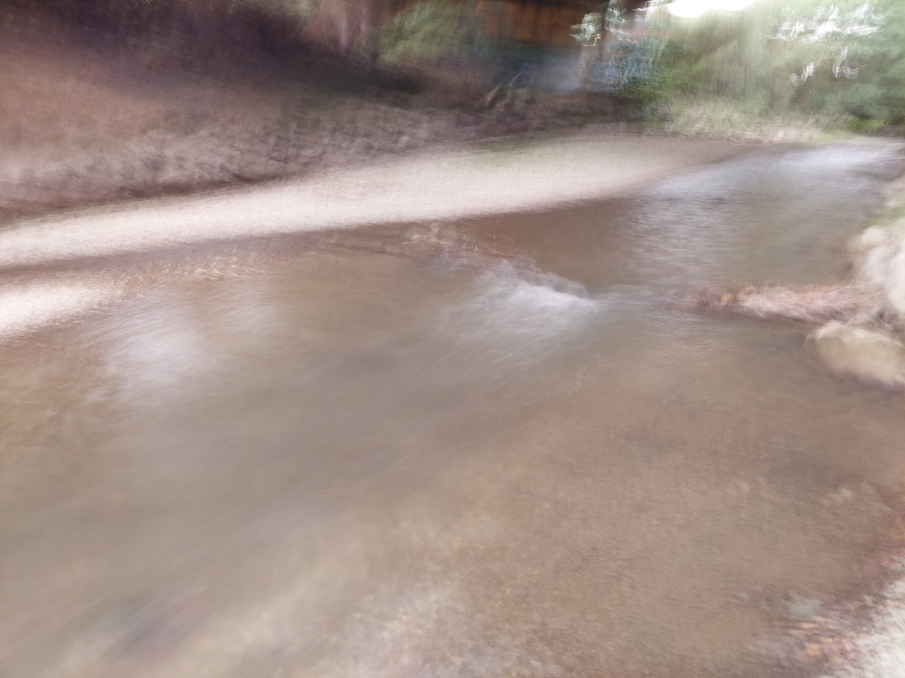
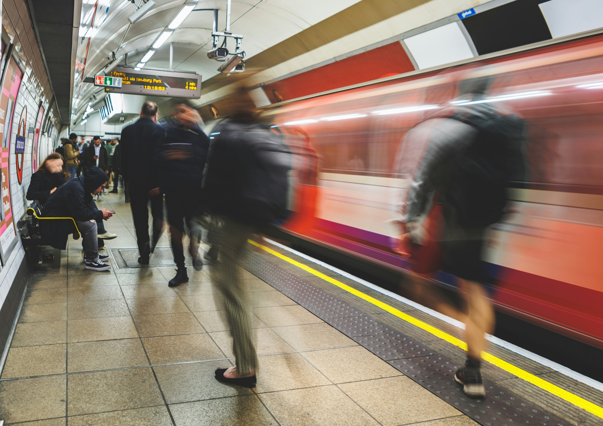
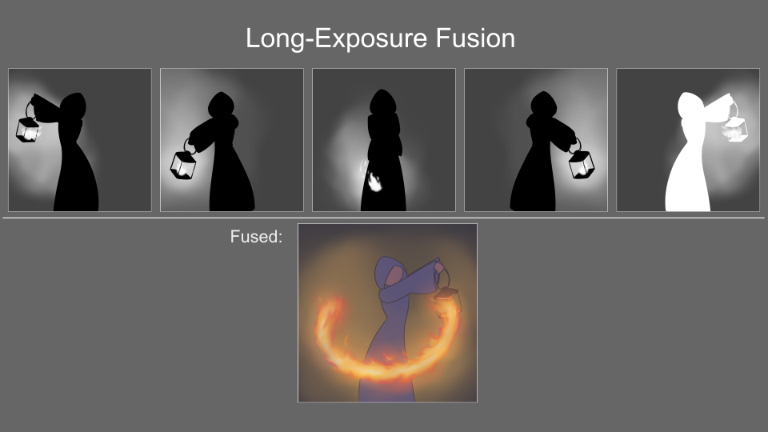
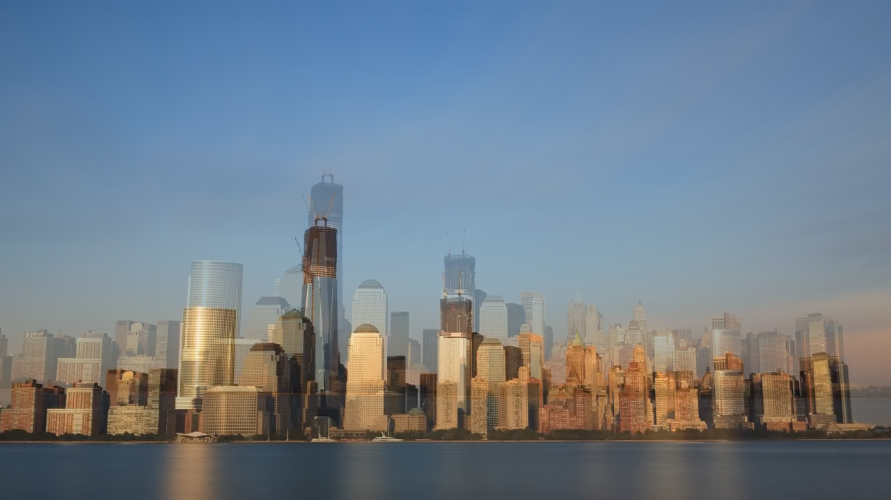
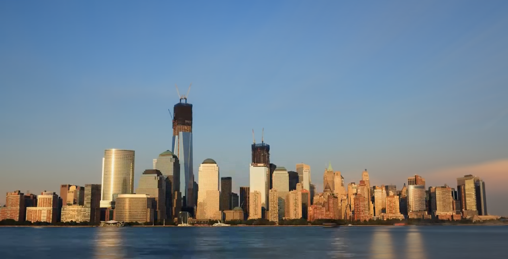
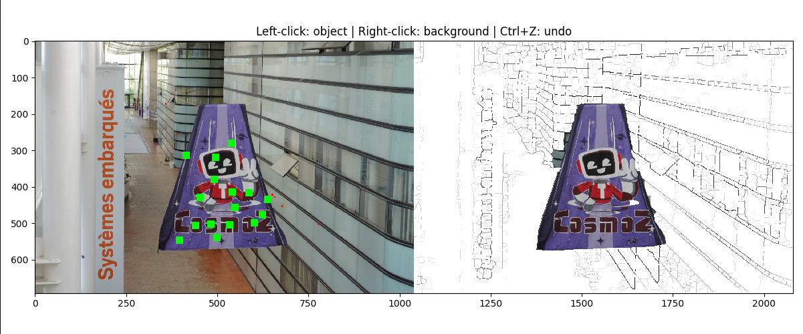

# Long-Exposure Fusion


eee
## Introduction

**Long-Exposure Fusion** is a full Python pipeline that generates long-exposure style images from videos or burst photo sequences. Images are generated using our own variant of [Exposure Fusion](https://ieeexplore.ieee.org/document/4392748) that we call Hybrid Weight Map Fusion.


### Motivation

Long exposure images are notoriously hard to capture on non-professional equipment, such as equipment without stabilisation etc.



Our method allows for the creation of sythetised long-exposure style images using videos or burst image sequences as input.

Furthermore, long-exposure shots are often plagued by unintentional motion-blurring of subjects.



Our method is able to selectively apply motion blur to only certain objects in the scene.  
This is achieved by segmenting each input frame using [Higra](https://github.com/higra/Higra). These segmentations are then used to define hybrid weight maps which determine how each pixel of each frame is scaled before being blended with the full sequence. This process is illustrated in the figure below with the weight maps illustrated in grayscale.



While some [paid proprietary methods](https://apps.apple.com/us/app/spectre-camera/id1450074595) already automate the creation of long-exposure style images from videos. Our method aims to allow for better control of how inputs are fused using the aforementioned segmented hybrid weight maps.

### Example

Long-Exposure Fusion is designed to process videos of scenes with slight changes over time, such as this one below:


Without the use of weight maps, a simple mean of all input images yields a dull result with washed out colors and odd trails left by the cars.



Our method is able to treat different objects in the image differently.  
In this example, we've chosen different weight maps for the sky, lake and buildings so that:
- the sky and laked is fused while giving more impact to brighter pixels.
- the buildings remains static, taken from the sharpest frame.



## Installation

### Disclaimer

This repository is brand new and you may encounter problems before you get everything running.

The steps below describe how to install this project on a Linux system with python 3.11.13 and cuda 12.9 and were tested using WSL.
Try using a different environment at your own risk.

### Source

First, clone this repository using:
```bash
git clone https://github.com/Saibot2012/Long-Exposure-Fusion-Recreation.git
cd long-exposure-fusion
```

Then ensure you have python 3.11.13 installed:
```bash
python3.11 --version
```
If you don't, you'll want to run something like:
```bash
sudo add-apt-repository ppa:deadsnakes/ppa
sudo apt install python3.11 python3.11-venv python3.11-dev
```

Create a virtual environment using:
```bash
python3.11 -m venv venv
source venv/bin/activate
```
All of the steps from now on should be run inside this venv.

Install the basic modules using:
```bash
pip install -r requirements.txt
pip install torch torchvision
```

### Dependencies

This repository depends on forks of [LightGlue](https://github.com/cvg/LightGlue) [Practical-RIFE](https://github.com/ThomasMPont/Practical-RIFE), and [SAM2](https://github.com/ThomasMPont/sam2-sequential).
Download them using:
```bash
git submodule update --init
```

#### LightGlue

Install LightGlue from the `LightGlue` submodule:
```bash
pip install -e ./external/LightGlue
```

#### Practical-RIFE

Download [this model](https://drive.google.com/file/d/1ZKjcbmt1hypiFprJPIKW0Tt0lr_2i7bg/view?usp=sharing) and 
`train_log/` into `external/Practical-RIFE/`.  
You may also use any other of the [pretrained Practical-RIFE models](https://github.com/ThomasMPont/Practical-RIFE#trained-model).

#### SAM2

SAM2 requires compiling a custom CUDA kernel with the nvcc compiler. If it isn't already available on your machine, please install [the CUDA toolkits](https://developer.nvidia.com/cuda-toolkit-archive) with a version that matches your PyTorch CUDA version.

Install SAM2 from the `sam2-sequential` submodule:
```bash
pip install -e ./external/sam2-sequential
```

Download [this model](https://dl.fbaipublicfiles.com/segment_anything_2/092824/sam2.1_hiera_tiny.pt) and paste the `.pt`file into `external/sam2-sequential/checkpoints/`.  
You may also use any other of the [pretrained SAM2 models](https://github.com/ThomasMPont/sam2-sequential?tab=readme-ov-file#download-checkpoints).
If you choose to do so, you'll have to edit the model path in `src/pipeline/segment_picker.py`.

#### CV2

To decode video inputs, you'll need to install CV2:
```bash
sudo apt update
sudo apt install cv2
```

## Demo

Now that you've installed everything, let's try running the main script on an example:
```bash
source venv/bin/activate
python long_exposure_fusion.py demo/timelapse6.mp4 -m demo/lake.yaml -o demo/output --align --interpolate 2
```
In case you've missed installs or encounter errors, intermediate results you've achieved are cached under `.cache/`.
At any time, you may add the parameter `--clear-cache` to this script to start from scratch.

After running the command above, you should see:
- cv2 decode the input video `demo/timelapse6.mp4`
- LightGlue align and crop all frames to the sharpest frame.
- RIFE interpolate frames to double the framerate.
- The Higra segmenter UI open.

In the Higra segmenter:
- Click on the areas you want fused and leave the rest empty. 
For example, we want to fuse the sky in the skyline:
- Left click on the sky
- Leave the rest of the area empty.
- Should you select a wrong area by mistake, simply just right click to deselect the area, or just press CTRL + Z.
Press Esc after you are done selecting the areas.


After that, the fusing should commence. Take a break while the code does its thing!

Once the script is finished, go check out your results in `demo/output`.  
`first.png`, `last.png`, and `reference.png` only hold frames of the input.  
`constant.png` is a simple single weight map fusion of the video where everything is given equal weight.
`partial.png` uses the mask you've defined to selectively blur out the lake without affecting other elements.
`luminance.png` gives the most weight to the green.
 
 The various heatmaps show you the pixels at work:
 - The left heatmap shows how many pixels was included in the fusion. If all frames are used, the heatmap should show white.
 - The right heatmap shows the weight that each pixel has. For areas that are fused, the colour should not be too bright, due to averaging of the pixels from all the frames. For areas that are not fused, the colour should be bright because it only has 1 weight, which is taken from the reference frame.

## Usage

### Parameters

**Required:**
- `input`: Path to input video file or directory containing image sequence
- `-m | --maps <file>`: `.yaml` file defining weight maps for fusion (see Weight Maps section below)

**Optional:**
- `-o | --output <dir>`: Output directory for fused images (output will be cached no matter what)
- `--align`: Align frames before fusion (recommended for moving cameras)
- `--interpolate <multi>`: Interpolate frames to increase framerate (use sparingly)
- `--pyramid`: Process weight maps using pyramid decomposition (as done in the original [Exposure Fusion](https://ieeexplore.ieee.org/document/4392748))
- `--clear-cache`: Clear intermediate results and start from scratch
- `--start`: To specify the boundary as to where the video starts, should you choose not to use the whole video.
- `--end`: To specify the boundary as to where the video ends. If not specified, the video will run till the end.

### Higra segmenter

The higra segmenter, developed by Jean Cousty and other researchers in France, is one of the most important steps in this pipeline. With it, we need not go through individual frames to select the regions needed to be fused.



### Weight Maps

You've reached the core of the project: **weight maps**.
This section lists which weight maps are available for image fusion and how you can combine them into complex hybrid weight maps.

Basic (usable as type: x in YAML):

- exposure — contrast × saturation × well-exposedness combined
- contrast — Laplacian edge response
- saturation — std deviation across RGB channels
- wellExposedness — Gaussian centered at mid-brightness (0.5)
- value — max across RGB channels per pixel
- linearValue — same as value but after sRGB→linear conversion
- luminance — perceptual brightness (0.2126R + 0.7152G + 0.0722B)
- constant — all ones

Composite/special (also usable in YAML):

- masked — blends multiple weight maps using segmentation masks
- time_lapse — Gaussian temporal decay around a reference frame
- reference — weight of frame_count on the reference frame, 0 elsewhere

Modifiers (wrap any of the above):

- weight: <float> — scales the output
- inverse: true — takes 1/output

## Pipeline

The following section describes the steps of our Long-Exposure Fusion pipeline.

The pipeline is run in `long_exposure_fusion.py`.

### Decode

If the input is in video form, we first decode it into a sequence of frames using [cv2](https://opencv.org/reading-and-writing-videos-using-opencv/).

This is implemented in `src/pipeline/decode_video.py`.

### Align

Any input that was not captured by a completely static camera should be aligned before any further processing.

If `--align` is set, we use [LightGlue](https://github.com/cvg/LightGlue) with [DISK](https://arxiv.org/abs/2006.13566) as feature extraciton method to compute a transformation that maps each frame onto the reference frame.
Then, frames with a large enough overlap with the reference frame are cropped onto the largest common rectangle between the aligned frames using [lir](https://github.com/OpenStitching/lir).

This is implemented in `src/pipeline/align_images.py`.

### Interpolate

If the framerate of our input sequence is too low, objects might jump too far between frames. This may lead to visible artifacts in our final fusion.

If `--interpolate <multi>` is set, we use [Practical-RIFE](https://github.com/hzwer/Practical-RIFE) to interpolate intermediate frames, which augments the framerate of our input by a factor of `<multi>`.

This is a costly step and should only be done when necessary.  
It is implemented in `src/pipeline/interpolate_images.py`.

### Segment

In order to treat the various sections of our scene differently during fusion, we use [Higra](https://www.researchgate.net/publication/336390968_Higra_Hierarchical_Graph_Analysis) to define and propagate segmentation masks across our image sequence.

The Higra Segmenter interface allows us to define masks for any number of objects that are then propagated through the image sequence. These masks will be used to restrict the application of the weight maps we define for our fusion step.

This is implemented in `src/pipeline/segment_higra.py`.

### Fusion

The fusion step intelligently combines the input images using the maps defined in `--maps <yaml_file>`.
The all important `masked` weight map applies a given list of weight maps to the distinct sections defined in the segmentation step.

The results of fusion are then copied into the directory provided in `--output <output_dir>`

This is implemented in `src/pipeline/fuse_images.py`.
# Long-Exposure-Fusion-Recreation
